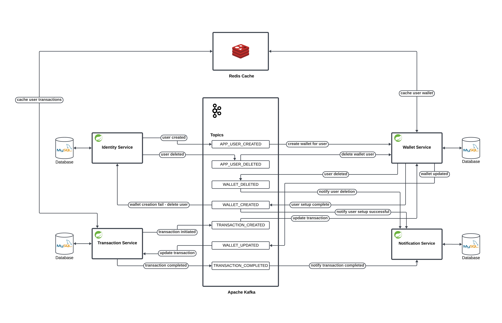
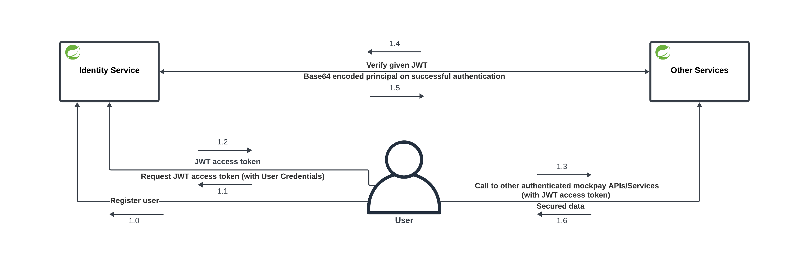

<h1 align="center">
  <br>
  
  <br>
  MockPay
  <br>
</h1>

<p align="center">
  
  <a href="https://opensource.org/licenses/MIT">
    
  </a>
   
  
</p>

<p align="center">
  <a href="https://sonarcloud.io/summary/new_code?id=mockpay_identity-service">
    
  </a>
  <a href="https://github.com/arpith-s/mockpay/actions">
    
  </a>  
  <a href="https://github.com/arpith-s/mockpay">
    
  </a>
  <a href="https://github.com/arpith-s/mockpay/commits/master">
    
  </a>    
  <a href="https://github.com/arpith-s/mockpay">
    
  </a>
</p>

<h4 align="center">
  <i>Mock of a simple Payments Backend 🚀</i>
  <br>
  🚧 <sub>Work in Progress (WIP)</sub>
</h4>


## 📜 Table of Contents
- [Introduction](#-introduction)
- [Architecture](#️-architecture)
    - [System design and flow](#system-design-and-flow)
    - [Authentication flow](#authentication-flow)
- [API Documentation](#-api-documentation)
    - [Identity Service](#identity-service)
    - [Transaction Service](#transaction-service)
    - [Wallet Service](#wallet-service)
- [Built With](#-built-with)


## 🌟 Introduction
Simplify your payment processing with our lightweight and user-friendly payments backend. Crafted to emulate the core functionalities of renowned payment gateways, this backend delivers a straightforward solution for simulating seamless payment transactions.


## 🛠️ Architecture
Explore the inner workings: a clear visual breakdown of the system's design and flow, simplifying the complexity behind MockPay's architecture.

### System design and flow
<p align="center">
  
  <br>
</p>

### Authentication flow
<p align="center">
  
  <br>
</p>


## 📚 API Documentation

- ### Identity Service
    - **Deployed Base URL:** `https://identity-service-mockpay-c77097e48e00.herokuapp.com`

    - **Endpoint:** `/identity-service/v1/user/create`
        - **Description:** Create a new mockpay user.
        - **HTTP Method:** `POST`
        - **Payload:** `JSON`

            ```json
            {
                "name": "userOne",
                "email": "userOne@gmail.com",
                "password": "jfkgdhjsgf",
                "mobile": "+91987654321",
                "age": 25,
                "userType": "CLIENT"
            }

    - **Endpoint:** `/identity-service/v1/user/fetch`
        - **Description:** Get the current authenticated mockpay user.
        - **HTTP Method:** `GET`
        - **Header:** `Authorization Bearer JWT Token`

    - **Endpoint:** `/identity-service/v1/user/update`
        - **Description:** Update authenticated mockpay user.
        - **Header:** `Authorization Bearer JWT Token`
        - **HTTP Method:** `PATCH`
        - **Payload:** `JSON`

            ```json
            {
                // "name": "userOne"
                // "email": "userOne@gmail.com",
                "password": "525gh5h435hr45h6455qwdz"
                // "authorities": "CREATE_USER,UPDATE_USER,DELETE_USER"
            }

    - **Endpoint:** `/identity-service/v1/user/delete`
        - **Description:** Delete authenticated mockpay user.
        - **Header:** `Authorization Bearer JWT Token`
        - **HTTP Method:** `DELETE`

    - **Endpoint:** `/identity-service/v1/token/generate`
        - **Description:** Generate JWT access token for a mockpay user.
        - **Header:** `Authorization Basic base64(username:password)`
        - **HTTP Method:** `GET`

    - **Endpoint:** `/identity-service/v1/token/verify`
        - **Description:** Verify given JWT access token.
        - **Header:** `Authorization Basic base64(serviceUser:serviceUserPassword)`
        - **HTTP Method:** `POST`
        - **Payload:** `JSON`

            ```json
            {
            "username": "userOne@gmail.com",
            "token": "eyJhbGciOiJIUzI1NiIsInR5cCI6IkpXVCJ9"
            }

- ### Transaction Service
    - **Deployed Base URL:** `https://transaction-service-mockpay-7d36a97aa9b9.herokuapp.com`

    - **Endpoint:** `/transaction-service/v1/transaction/fetch`
        - **Description:** Get all transactions for authenticated mockpay user.
        - **Header:** `Authorization Bearer JWT Token`
        - **HTTP Method:** `GET`

    - **Endpoint:** `/transaction-service/v1/transaction/transact`
        - **Description:** Create a new transaction.
        - **HTTP Method:** `POST`
        - **Payload:** `JSON`

            ```json
            {
                "receiverId": "userTwo@gmail.com",
                "amount": 30,
                "reason": "Dinner"
            }

- ### Wallet Service
    - **Deployed Base URL:** `https://wallet-service-mockpay-0ec11f774315.herokuapp.com`
    - **Endpoint:** `/wallet-service/v1/wallet/fetch`
        - **Description:** Get wallet balance of current authenticated mockpay user.
        - **Header:** `Authorization Bearer JWT Token`
        - **HTTP Method:** `GET`


## 🔩 Built With
* [Java](https://www.oracle.com/java/technologies/downloads/) - Java is a high-level, class-based, object-oriented programming language that is designed to have as few implementation dependencies as possible.
* [Spring Boot](https://spring.io/) - Spring Boot makes it easy to create stand-alone, production-grade Spring based Applications that you can "just run".
* [MySQL](https://www.mysql.com/) - MySQL is an open-source relational database management system.
* [Apache Kafka](https://kafka.apache.org/) - Apache Kafka is a distributed event store and stream-processing platform.
* [Redis](https://redis.io/) - Redis is an open-source in-memory storage, used as a distributed, in-memory key–value database, cache and message broker, with optional durability.